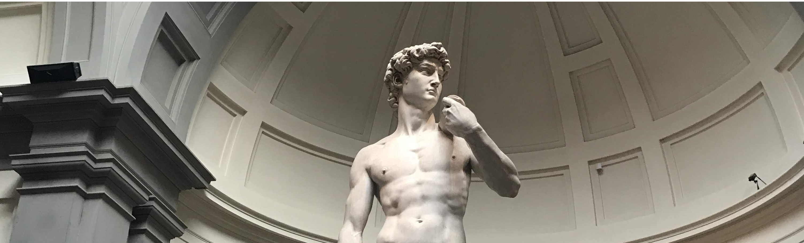

<div style="margin-bottom: 20px;">
  
</div>

# BAT [Bruninvestor Algorithmic Trading]

BAT is a comprehensive algorithmic trading system that supports both **stocks and cryptocurrencies** with multiple trading strategies and execution modes.

## Disclaimer
This project is for educational purposes only. It is not financial advice. Always conduct thorough research or consult with a professional financial advisor before making financial or investment decisions.

## Trading Modes

### 1. Backtesting Mode
- Test strategies on historical data
- Custom time periods
- Risk-free strategy validation
- Interactive performance charts
- Detailed trade analysis

### 2. Live Trading Mode
- Real-time trading execution
- Live candlestick charts
- Automated signal processing
- Real-time P&L tracking

### 3. Research and Optimization
- Data collection for different tickers
- Parameter tuning and testing
- Efficient optimization for paramters

## Features

- **Unified Trading Platform** - Trade both stocks and crypto from one interface
- **Multiple Strategies** - Bollinger Bands, RSI, MACD, Moving Averages
- **Dual Trading Modes** - Backtesting and Live Trading
- **Real-time Charts** - Interactive candlestick charts with indicators
- **Multiple Brokers** - Alpaca Paper Trading and Simulated Broker
- **Comprehensive Analysis** - Detailed performance metrics and visualizations

## Quick Start

### Main Application 
```bash
python3 main.py
```
Choose between backtesting, research, and live trading with custom parameters.